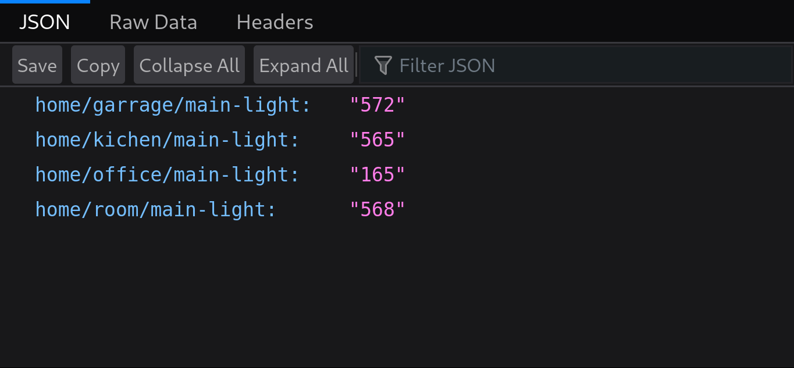

* You need to have mosquitto broker installed
* type`mosquitto` in your shell to start broker
* `python py_pub.py` will start your devices to send data
* `go run main.go` will start webservice at [localhost:8000](http://localhost:8000/)
* but for the sake of emulation you need to go to [http://localhost:8000/api/mqtt/](http://localhost:8000/api/mqtt/https:/)

*  
